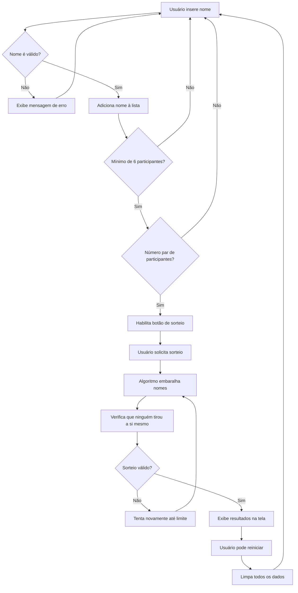

<div align="center">
   
</div>

<br>

<div align="center">
  
  
  
    
  
    
</div>

<br>

<div align="center">
  https://oracleonechallenge.vercel.app
</div>

# ONE Challenge

Este projeto representa um dos desafios do programa **Oracle Next Education (ONE)**, uma iniciativa da Oracle em parceria com a Alura que visa capacitar pessoas em tecnologia e conectá-las com oportunidades de emprego na América Latina. A aplicação desenvolvida é um sistema interativo para organizar sorteios de Amigo Secreto, aplicando conceitos modernos de desenvolvimento front-end.

### Índice

- [Sobre](#sobre)
- [Desenvolvimento](#desenvolvimento)
  - [V.1.0](#v10--javascript)
  - [V.1.1](#v11--typescript)
  - [V.1.2](#v12--sassscss)
- [Funcionalidades](#funcionalidades)
- [Pré-requisitos](#pré-requisitos)
- [Instalação](#instalação)
- [Funcionamento](#funcionamento)
- [Oracle Next Education](#oracle-next-education--one)

## Sobre

Este projeto demonstra a aplicação prática de diversos conhecimentos adquiridos durante a formação do programa ONE. O Amigo Secreto é uma aplicação web que facilita a organização de sorteios, garantindo uma distribuição justa e aleatória entre os participantes.

Desenvolvido com foco em boas práticas de programação, o projeto evoluiu de uma base JavaScript para uma implementação TypeScript, incorporando princípios funcionais e ferramentas modernas de desenvolvimento.

A interface HTML e CSS foi disponibilizada inicialmente pelo programa, permitindo que o foco do desenvolvimento fosse na implementação da lógica da aplicação e na evolução gradual da arquitetura do código.

### Regras

A aplicação implementa regras específicas para garantir um sorteio adequado:

- Exige um mínimo de 6 participantes
- Requer um número par de participantes
- Garante que ninguém sorteie a si mesmo
- Evita duplicação de nomes
- Limita as tentativas de sorteio para prevenir loops infinitos

## Desenvolvimento

Este projeto está evoluindo através de diferentes versões, cada uma trazendo melhorias significativas:

### V.1.0 ' JavaScript

A primeira versão focou na implementação da lógica fundamental utilizando:

- HTML5 e CSS3 fornecidos pelo programa
- JavaScript modular (ES6+) para organizar o código em:
  - Arquivos independentes e reutilizáveis
  - Funções que processam dados sem efeitos colaterais
  - Gerenciamento organizado das interações com a página
- Controle de versão organizado com branches específicas para cada funcionalidade

### V.1.1 ' TypeScript

A versão atual trouxe melhorias na qualidade e manutenção do código através de:

- TypeScript para adicionar:

  - Verificação de tipos durante o desenvolvimento
  - Código mais autoexplicativo através de interfaces e tipos
  - Melhor suporte em ferramentas como Visual Studio Code, ESLint e Debugger

- Organização do código seguindo princípios funcionais:

  - Funções que sempre retornam o mesmo resultado para os mesmos parâmetros
  - Criação de novos dados em vez de modificar existentes, facilitando rastreamento de mudanças e prevenção de bugs
  - Combinação de funções simples para criar operações complexas

- Ambiente de desenvolvimento com Vite, oferecendo:
  - Atualização instantânea durante o desenvolvimento
  - Combinação e otimização dos arquivos para produção
  - Gerenciamento eficiente de dependências

O projeto utiliza GitFlow para organização das branches:

- `main`: código em produção
- `develop`: desenvolvimento ativo
- `feature/*`: implementação de novas funcionalidades
- `hotfix/*`: correções urgentes em produção
- `release/*`: preparação de novas versões
- Tags para releases (ex: v1.0, v1.1)

### V.1.2 ' SASS/SCSS

> Versão em desenvolvimento

A próxima versão focará em uma reelaboração completa da interface, agora que a lógica está desenvolvida e bem testada. As principais melhorias incluirão:

- **Reformulação do Design**

  - Interface completamente redesenhada
  - Layout responsivo para todas as telas
  - Migração de CSS para SASS/SCSS para melhor organização dos estilos
  - Sistema de design com variáveis e componentes reutilizáveis

- **Experiência do Usuário Aprimorada**
  - Lista interativa para gerenciamento de participantes
  - Funcionalidades de edição e exclusão de nomes
  - Substituição dos alertas do navegador por modais específicos
  - Feedback visual mais sofisticado para ações do usuário

## Funcionalidades

A aplicação oferece uma experiência completa de sorteio com:

- Validação em tempo real dos participantes
- Sistema de sorteio automatizado e justo
- Exibição clara dos resultados
- Opção de recomeçar o sorteio a qualquer momento
- Feedback visual para todas as ações do usuário

## Pré-requisitos

Para executar o projeto em seu ambiente local, você precisará de:

- Node.js instalado em sua máquina
- Um navegador web moderno (Chrome, Firefox, Edge, Safari, etc)
- Git instalado para clonar o repositório

## Instalação

Siga estes passos para configurar o projeto em seu ambiente local:

1. Clone o repositório usando HTTPS:

   ```bash
   git clone https://github.com/fabiodelllima/amigo-secreto.git
   cd amigo-secreto
   ```

   Ou usando SSH:

   ```bash
   git clone git@github.com:fabiodelllima/amigo-secreto.git
   cd amigo-secreto
   ```

2. Instale as dependências:

   ```bash
   npm install
   ```

3. Inicie o servidor de desenvolvimento:

   ```bash
   npm run dev
   ```

4. Acesse a aplicação em seu navegador através do endereço indicado no terminal

## Funcionamento

Siga estes passos para utilizar a aplicação:

1. Digite o nome de um participante no campo de entrada
2. Clique em "Adicionar" ou pressione Enter
3. Repita o processo até ter no mínimo 6 participantes (número par)
4. Clique em "Sortear amigo" para realizar o sorteio
5. Os resultados serão exibidos na tela
6. Use o botão "Recomeçar" para fazer um novo sorteio

### Diagrama

O diagrama abaixo ilustra o fluxo interno da aplicação, incluindo as validações e o algoritmo de sorteio:



## Oracle Next Education — ONE

Este projeto é parte de uma jornada de aprendizado no programa Oracle Next Education, onde conceitos fundamentais de programação se transformam em aplicações práticas. Através dele, foram aplicados conhecimentos de:

- Lógica de programação e estruturas de dados
- Desenvolvimento front-end moderno
- Versionamento e metodologias ágeis
- Boas práticas e padrões de projeto

### Agradecimentos

- Oracle e Alura pela oportunidade de participação no programa ONE
- Instrutores e mentores do programa
- Comunidade de desenvolvedores do Oracle ONE
